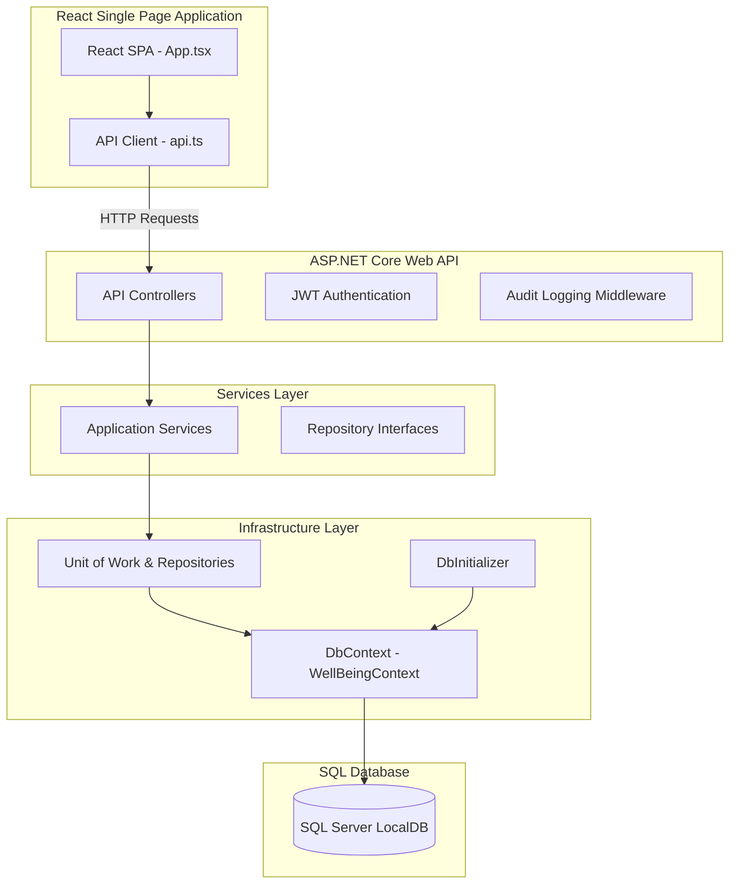

# WellBeing360: Project Architecture & Functional Specification

This document provides a comprehensive, end-to-end breakdown of the **WellBeing360** application. It covers the system architecture, database design, backend services, frontend portals, role-based workflows, and how the entire project fits together. You can use this document to present the project to stakeholders, managers, or developers.

---

## 1. High-Level Architecture

WellBeing360 is built using a modern **Separation of Concerns** paradigm, utilizing a **Single Page Application (SPA) frontend** and a **Web API backend** backed by **SQL Server LocalDB** with Entity Framework Core (EF Core).

### Layer Breakdown
1. **Frontend (React + Vite + TypeScript)**: Responsible for the visual interface, state management, and calling the backend API via the standard Fetch client.
2. **Web API (ASP.NET Core / .NET 10)**: Exposes secure REST endpoints. Handled by controllers, protected by JWT authentication, and monitored by custom audit logging middleware.
3. **Core (Domain Entities & Interfaces)**: Defines the core business entities (database models) and abstraction contracts (interfaces) for repositories and services. This layer has zero external dependencies.
4. **Services (Business Logic Layer)**: Implements core business logic, validation rules, point accumulation math, and orchestration.
5. **Infrastructure (Data Access Layer)**: Implements Entity Framework Core, repositories, Unit of Work patterns, and database seeding on startup.

---

## 2. Database Schema & Seed Data

The database consists of **17 relational tables** modeled using Entity Framework Code-First. 

### Core Database Entities

| Entity / Table | Description |
| :--- | :--- |
| **User** | Registered users containing profile data, email, password hashes, grade (G1-G5), department, phone, and role. |
| **BenefitPlan** | Configured benefits (e.g., Insurance, Dental/Vision, Flexible Wellness). |
| **FlexBenefitBucket** | Buckets under flexible benefit plans (e.g., Medical, Childcare, Fitness, Education). |
| **EnrolmentWindow** | Period during which employees can enroll in benefit plans. |
| **BenefitEnrolment** | Records of which plans employees enrolled in, coverage options, and contributions. |
| **Dependent** | Spouse, children, or parents linked to employee benefit plans. |
| **WellnessProgram** | Wellness initiatives (e.g., Active Spring 2026). |
| **WellnessChallenge** | Specific challenges under a program (e.g., 10K Steps Challenge) with targets and points. |
| **ActivityLog** | Employee progress entries logged against wellness challenges to earn points. |
| **EAPService** | Employee Assistance Program categories (Counseling, Financial Advisory, Legal Support). |
| **EAPSession** | Booked counseling sessions tracking request date, scheduled date, and counselor reference. |
| **RecognitionAward** | Peer-to-peer nomination awards, tracking nominator, recipient, category, badge name, and message. |
| **RewardPoints** | Tracks the loyalty/reward points balance (Earned, Redeemed, Balance) for each employee. |
| **RedemptionCatalog** | Reward items available for purchase using accrued points (e.g., Vouchers, Gym Bags). |
| **BenefitsReport** | Analytics reports summarizing utilization metrics, enrollment rate, and employer cost. |
| **Notification** | Real-time and persistent alerts sent to employees regarding benefits, wellness, and awards. |
| **AuditLog** | Immutable audit trails tracking user actions, modules accessed, and timestamps for compliance. |

### Seed Data (South Indian Profiles)
To provide a realistic enterprise demo, the database seeds default accounts on startup:

| Name | Role | Email | Password | Phone |
| :--- | :--- | :--- | :--- | :--- |
| **gopal** | Employee | `employee@wellbeing360.com` | `password` | `+91-98400-11001` |
| **dharshan** | HR Benefits Admin | `hrbenefits@wellbeing360.com` | `password` | `+91-98400-11002` |
| **Vignesh** | Finance Executive | `finance@wellbeing360.com` | `password` | `+91-98400-11003` |
| **Nishanth** | Wellness Coordinator | `wellness@wellbeing360.com` | `password` | `+91-98400-11004` |
| **pradeep** | Recognition Manager | `recognition@wellbeing360.com` | `password` | `+91-98400-11005` |
| **Madhav** | System Administrator | `admin@wellbeing360.com` | `password` | `+91-98400-11006` |

---

## 3. Backend Implementation Detail

The backend API project is designed with structural clarity, relying on dependency injection:

### Main Components
* **`Program.cs`**: Setup configuration, configures dependency injection, database initialization/seeding triggers, CORS policies, custom middleware, JWT authentication, and Swagger documentation endpoint generation.
* **Audit Logging Middleware**: A custom HTTP request middleware (`AuditLoggingMiddleware.cs`) that intercepts requests. If the request is authenticated, it records the user, action performed, and current timestamp into the `AuditLogs` table automatically.
* **Service Orchestrators**:
  * `UserManagementService`: Authentication, registration, password hashing, and user role management.
  * `BenefitManagementService`: Handles open enrolment logic, plan creation, window scheduling, and flexible benefit allocation.
  * `WellnessManagementService`: Manages programs, active challenges, and updates the `RewardPoints` table when activity logs are submitted.
  * `EapManagementService`: Books EAP sessions and manages appointment schedules.
  * `RecognitionManagementService`: Coordinates peer-to-peer nominations, badge allocations, and item redemptions.

---

## 4. Frontend Implementation Detail

The frontend is a lightweight Single Page Application built on **React 19** and **Vite 8**. 

### Highlights
* **Glassmorphic Monochromatic UI**: A high-end minimal dark/light styling theme inspired by luxury editorial interfaces. Uses CSS custom properties and shadows to render card components.
* **`api.ts`**: The centralized client that coordinates network calls, injects the JWT token from `localStorage` in the request headers, and manages user state.
* **Role-Based Routing/Rendering**: A single entry component (`App.tsx`) checks the logged-in user's role and renders the corresponding portal interface.

---

## 5. Role-Based Portals & User Workflows

The portal supports **6 different roles**, each with a custom dashboard dashboard:

### A. Employee Portal
Employees are the consumers of the wellness benefits. Their dashboard contains:
1. **My Dashboard**: View point balances, enrolled insurance plans, scheduled EAP counseling appointments, and peer awards.
2. **Benefits Enrollment**: Allows enrolling in active health insurance or dental/vision plans, inputting dependents, and calculating premium deductions.
3. **Wellness & Activity**: Log daily step challenges or hydration sprint achievements to instantly earn reward points.
4. **EAP Counselling**: Book a private session with an advisor (mental health, legal, or financial counseling).
5. **Redeem Rewards**: Spend accumulated points on catalog items (gift cards, gym bags, cushions).

### B. HR Benefits Admin Portal
HR administrators configure the benefits suite:
* View existing benefit plans.
* Add new health, vision, or dental plans.
* Open new Enrolment Windows for employees specifying start/close dates and eligible employee grades.

### C. Wellness Coordinator Portal
Coordinators keep the workforce engaged:
* Configure new **Wellness Programs** (e.g., Active Autumn).
* Create **Challenges** with daily step, water, or meditation targets, specifying active durations and reward point bonuses.

### D. Recognition Manager Portal
Managers drive workplace culture:
* Configure and manage the **Redemption Catalog** (add new voucher items, stock counts, and point costs).
* View all peer-to-peer awards submitted by the workforce.

### E. Finance Executive Portal
Finance oversees utilization metrics:
* Generate **Utilization & Coverage Reports** showing overall enrollment rates, employer premium shares, and EAP session bookings.
* Filter analytics reports dynamically by quarter (Q1, Q2, Q3, Q4) to monitor company-wide spend.
* Approve or schedule requested EAP appointments for employees.

### F. System Administrator Portal
System Admins maintain compliance and logs:
* Access the **Compliance Audit Logs** compiled in real time by the audit logging middleware.
* Create new custom user accounts or register employees.
* Use the **Act As** user-switcher to quickly test functionality across different user accounts.

---

## 6. How the System Seeds & Auto-Runs

1. **Self-Repairing Database**: On backend startup, EF Core automatically deletes the old database instance (`EnsureDeleted()`) and builds a fresh database with modern tables (`EnsureCreated()`).
2. **Seeding**: The `DbInitializer.cs` class instantly injects the default South Indian profiles, standard health plans, open enrolment windows, wellness challenges, EAP counseling catalogs, notifications, and initial audit logs.
3. **Frontend-Backend Sync**: The frontend automatically points to port `5201`. The login page is clean of pre-fill dropdowns. A user inputs their seeded account credentials (e.g., `employee@wellbeing360.com` / `password`), which sends a `POST /api/auth/login` request. The API validates credentials, returns a JWT token, and logs the employee in to their custom portal.
